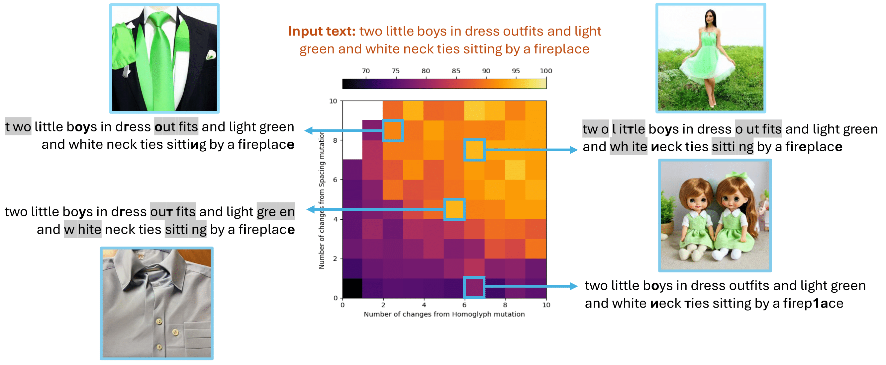

# Diversifying Adversarial Attacks on Text-to-image Generation
Official implementation of **"Diversifying Adversarial Attacks on Text-to-image Generation"**, accepted as poster paper at **GECCO 2025**.



## Install and setup
- Clone this repo

- Install dependencies:
```
pip install -r requirements.txt
```

## Run experiments
To run the attack with MAP-Elites:
```
python run_me_attack.py --ori_sent [original sentence] --log_path [root log path] --log_save_path [log save path] --intem_img_path [intermediate image save path] --elite_img_path [image save path] --save_all_images (whether save every generated image)
```

An example of running the attack with MAP-Elites on Stable Diffusion 3 Medium model:
```
python run_me_attack.py --ori_sent "Two little boys in dress outfits and light green and white neck ties sitting by a fireplace." --save_all_images
```

To run the attack with normal GA:
```
python run_ga_attack.py --ori_sent [original sentence] --log_path [root log path] --log_save_path [log save path] --intem_img_path [intermediate image save path] --elite_img_path [image save path] --save_all_images (whether save every generated image)
```

Or run the attack with NSGA-II:
```
python run_nsga2_attack.py --ori_sent [original sentence] --log_path [root log path] --log_save_path [log save path] --intem_img_path [intermediate image save path] --elite_img_path [image save path] --save_all_images (whether save every generated image)
```

## Citation

```bibtex
@inproceedings{NguyenLuongGECCO2025,
  author       = {Thai Huy Nguyen and Ngoc Hoang Luong},
  title        = {{Diversifying Adversarial Attacks on Text-to-image Generation}},
  booktitle    = {GECCO '25 Companion: Proceedings of the Genetic and Evolutionary Computation Conference Companion},
  address      = {Málaga, Spain},
  publisher    = {{ACM}},
  year         = {2025}
}
```


## Acknowledgements

Our code base is built upon:
- [RIATIG: Reliable and Imperceptible Adversarial Text-to-Image Generation with Natural Prompts](https://github.com/WUSTL-CSPL/RIATIG) by Han Liu, Yuhao Wu, Shixuan Zhai, Bo Yuan, Ning Zhang
- [OpenELM](https://github.com/CarperAI/OpenELM.git) by CarperAI
- [E-TF-MOENAS: Enhanced Training-free Multi-Objective Neural Architecture Search](https://github.com/ELO-Lab/E-TF-MOENAS.git) by Ngoc Hoang Luong, Quan Minh Phan, An Vo, Tan Ngoc Pham, Dzung Tri Bui
